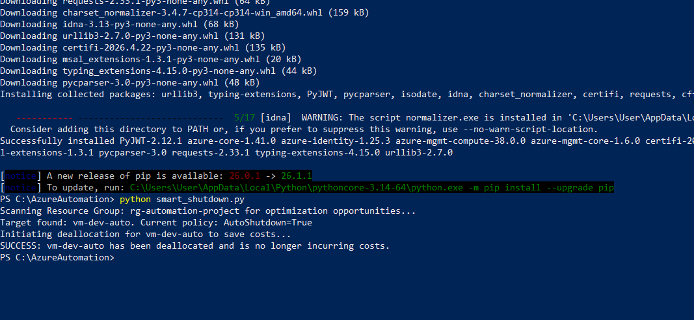
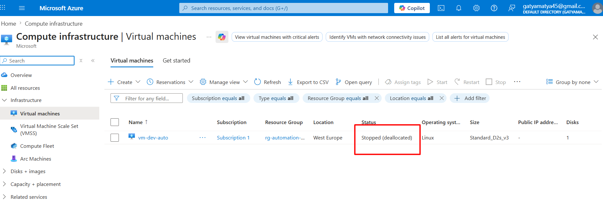

Azure Cost Optimization and Automation with Python and Terraform

Project Overview:
This project addresses a critical real-world business challenge: reducing unnecessary cloud expenditure caused by idle development resources. By combining Infrastructure as Code (Terraform) with Python scripting, I developed an automated solution that identifies and deallocates tagged virtual machines during non-business hours.

Technical Architecture:
- Infrastructure as Code: The environment (VM, VNet, NIC) is provisioned using Terraform, with specific metadata applied via an "AutoShutdown=True" tag.
- Automation Logic: A custom Python script leverages the "azure-mgmt-compute" library to interact with the Azure Resource Manager API.
- Security: The automation utilizes the Azure CLI credential context for secure authentication, following industry best practices.

 Challenges and Troubleshooting (Engineering Solutions):
During development, I successfully navigated several technical hurdles which deepened my understanding of local environment configuration and cloud SDKs:

 1. Python Environment and PATH Configuration
- Issue: The local system did not initially recognize Python commands due to missing environment variable configurations.
- Solution: I manually configured the Windows Environment Variables (PATH) to ensure global accessibility of the Python interpreter and the Pip package manager.

 2. Dependency and Package Management
- Issue: Azure SDK modules were initially unavailable when running the script.
- Solution: Resolved package management conflicts by using "python -m pip install" to correctly map the "azure-identity" and "azure-mgmt-compute" libraries to the active interpreter.

 3. Smart Resource Targeting
- Issue: It was critical to ensure the script only targeted development resources while leaving production systems untouched.
- Solution: Implemented filtering logic in Python that exclusively scans for the specific tags assigned during the Terraform provisioning phase.

Proof of Success and Validation:
1. Automated Lifecycle Execution

Evidence of the Python script execution: identifying the target VM and successfully initiating the deallocation process.

2. Azure Portal Confirmation

Visual confirmation from the Azure Portal: the VM status is "Stopped (deallocated)", reducing compute costs to 0 usd.

 Tech Stack
- IaC: Terraform
- Languages: Python (Azure SDK for Python)
- Tooling: Azure CLI, PowerShell, CMD
- Cloud Platform: Microsoft Azure (Compute, Networking)
